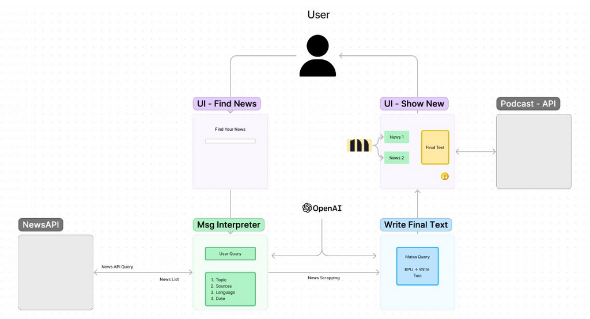

# Factify - AI-Powered News Synthesizer

## Hackathon 2023 - Entrepreneur First x Maisa


## Project Description

Factify is an AI agent application developed during a hackathon to address the low reader confidence in European journalism. Our solution aggregates articles from various sources and uses Large Language Models (LLMs) to synthesize a comprehensive, unbiased story for the user.

### Key Features:
- Searches for articles from multiple sources
- Extracts summaries and topics using the news library
- Deconstructs articles into bullet points using GPT-3.5-turbo
- Synthesizes relevant stories into a single, coherent narrative

### Technologies Used:
- Python
- LangChain
- Streamlit
- News Article APIs
- OpenAI's GPT-3.5-turbo API

While we didn't win the competition, this project provided valuable insights into the workings of tools like Perplexity AI. Future iterations could evolve Factify into a full-fledged news portal.

## Functionality Diagram



## Installation and Setup

1. Clone the repository:
   ```
   git clone https://github.com/yourusername/factify.git
   cd factify
   ```

2. Create and activate a virtual environment:
   - Windows:
     ```
     python -m venv venv
     venv\Scripts\activate
     ```
   - macOS/Linux:
     ```
     python3 -m venv venv
     source venv/bin/activate
     ```

3. Install dependencies:
   ```
   pip install -r requirements.txt
   ```

4. Run the application:
   ```
   streamlit run app.py
   ```

5. Enjoy and happy searching!

## Deactivating the Virtual Environment

When you're done, deactivate the virtual environment:
```
deactivate
```

## Updating Requirements

To update the `requirements.txt` file with new dependencies:
```
pip freeze > requirements.txt
```

## Contributing

We welcome contributions to Factify! Please feel free to submit issues, fork the repository and send pull requests!

## Acknowledgements

Special thanks to Entrepreneur First and Maisa for organizing the hackathon, and to Luis Bueno, Miguel Lavin, Pablo Ruiz and Jesus Lopez for working as a great team :D 